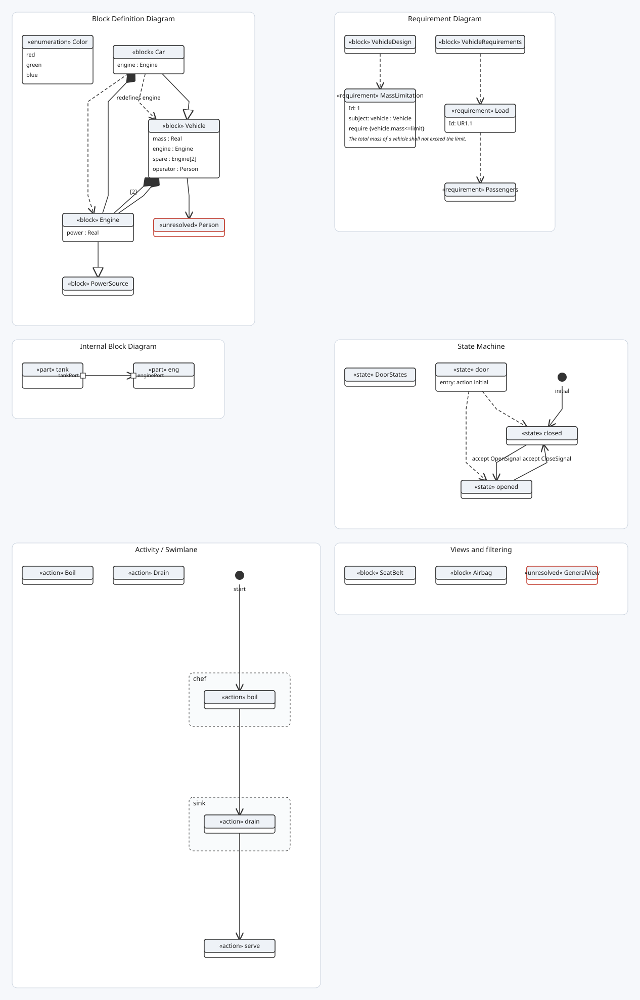
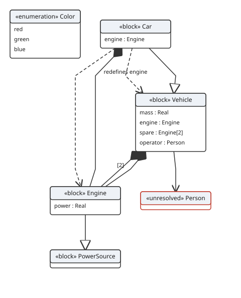

# sysml2-mermaid

English | [中文](README.zh.md)

Render **SysML v2** textual models (`.sysml`) as diagrams — a Mermaid external
diagram plugin, plus a CLI converter, a Language Server, and a VS Code
extension.

> Status: **v0.1.1**. Five views render end to end from `.sysml` text to SVG
> through the library API, the `sysml2svg` CLI (`--view bdd`, `requirement`,
> `ibd`, `statemachine`, `activity`), and the Mermaid plugin: **Block Definition
> Diagrams**, **Requirement diagrams**, **Internal Block Diagrams** (ports and
> connectors), **State machines**, and **Activity / Swimlane diagrams**. A
> **Language Server** (`packages/lsp`) and a **VS Code extension**
> (`packages/vscode-sysml`) add diagnostics, completion, hover, outline,
> syntax highlighting, and an SVG preview. A **gallery and playground** demo
> (`npm run dev`) and a full documentation set (`docs/`) round it out.

## What it aims to be

SysML v2 has a standard textual notation (`.sysml`) and a well-defined abstract
semantics, but few approachable toolkits. This project takes the "text is the
source of truth, diagrams are a live projection" approach — the same approach
proven by the sibling project [`mermaid-opm`](https://github.com/fengdonglu/mermaid-opm)
for OPM/OPL:

```
.sysml text (single source of truth)
   │  parse + validate
   ▼
semantic model (render-agnostic)
   │  view selection (which elements a diagram shows)
   ▼
scene (layout: dagre / ELK)
   │  render
   ▼
SVG — via a Mermaid external diagram plugin, a CLI, an editor LSP, or VS Code
```

No layout is persisted and no graphical editing is required: the diagram is
recomputed from the text every time.



## Views

Five views render from the same model:

- **Block Definition Diagram (BDD)** — parts, items and their relationships.
- **Requirement diagram** — requirements, satisfaction and verification.
- **Internal Block Diagram (IBD)** — ports and connectors.
- **State machine** — states, entry/do/exit and transitions.
- **Activity / Swimlane** — actions, control flow and `perform` lanes.

## Deliverables

- **Mermaid external diagram plugin** — `registerSysml()` for a `sysml` fenced block.
- **CLI** — `sysml2svg model.sysml -o model.svg` (no browser); `--view`, `--view-name`, `--layout`.
- **Library** — `renderSvg(source, { view, viewName, theme })` and `renderSvgAsync(source, { layout: 'elk' })`.
- **Language Server** — diagnostics, completion, hover, outline, go-to-definition, rename, formatting.
- **VS Code extension** — syntax highlighting, the language client, preview, and export.

See [`docs/ROADMAP.md`](docs/ROADMAP.md) and
[`docs/ARCHITECTURE.md`](docs/ARCHITECTURE.md).

## Demo



```bash
npm run build   # produces dist/sysml2-mermaid.mjs (browser bundle)
npm run dev     # serves http://localhost:3000
```

- **Gallery** — `http://localhost:3000/demo/index.html`: each example rendered through the Mermaid plugin.
- **Playground** — `http://localhost:3000/demo/playground.html`: edit `.sysml` on the left, pick a view, see the diagram and diagnostics live.
- **中文版** — `/demo/index.zh.html` and `/demo/playground.zh.html` (中文界面，示例源码带中文注释)。

Every page links back to the [GitHub repository](https://github.com/fengdonglu/sysml2-mermaid) from its header.

The first line of a model may carry a view directive (`sysml bdd`, `sysml requirement`, `sysml ibd`, `sysml statemachine`, `sysml activity`); without one the BDD view is used.

## Documentation

- [Architecture](docs/ARCHITECTURE.md)
- [Roadmap](docs/ROADMAP.md)
- [Design background](docs/design/BACKGROUND.md)

## Development note

This project is developed through AI-assisted **Vibe Coding**, with agents and
humans collaborating iteratively.

## License

MIT © fengdonglu
